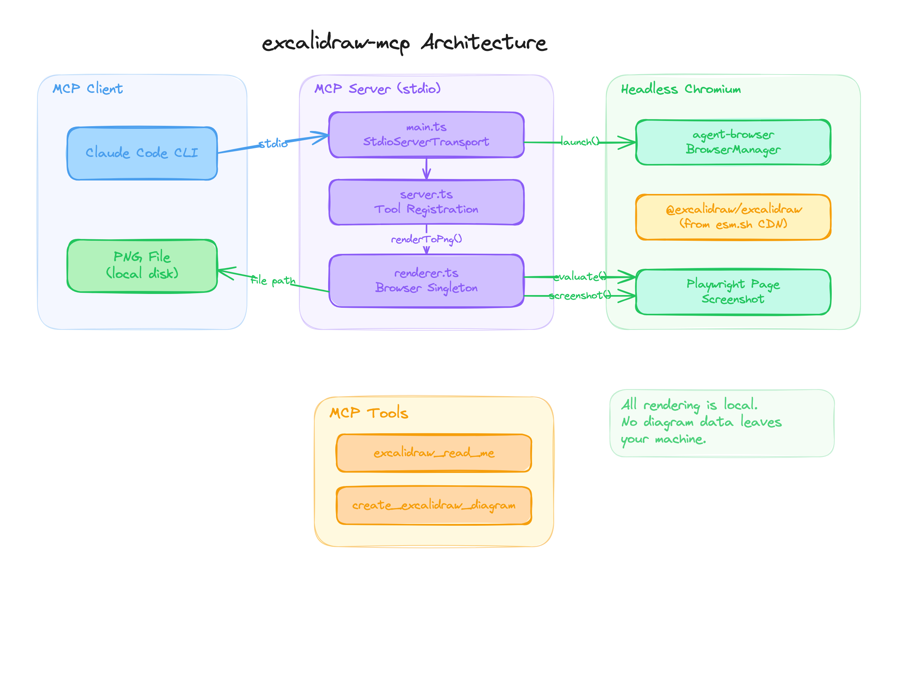

# excalidraw-render

Headless Excalidraw diagram renderer for **Claude Code CLI** and other MCP clients. Renders hand-drawn PNG diagrams locally — no data leaves your machine.

Uses headless Chromium (via [agent-browser](https://github.com/vercel-labs/agent-browser)) to render diagrams server-side. First render takes ~3s (browser launch + CDN import), subsequent renders ~60ms.

## Install

### One command (npm)

```bash
# Claude Code
claude mcp add --scope user --transport stdio excalidraw -- npx -y excalidraw-render

# Or with any MCP client
npx -y excalidraw-render
```

### From source

```bash
git clone https://github.com/bassimeledath/excalidraw-render.git
cd excalidraw-render
npm install
npm run build

# Add to Claude Code
claude mcp add --scope user --transport stdio excalidraw -- node /absolute/path/to/excalidraw-render/dist/index.js
```

### Claude Desktop / other clients

Add to your MCP config:

```json
{
  "mcpServers": {
    "excalidraw": {
      "command": "npx",
      "args": ["-y", "excalidraw-render"]
    }
  }
}
```

## Tools

| Tool | Description |
|------|-------------|
| `excalidraw_read_me` | Returns the Excalidraw element format reference (color palettes, element types, examples). Call once before drawing. |
| `create_excalidraw_diagram` | Renders an Excalidraw element JSON array to a PNG file. Returns the file path. |

## Usage

After installing, ask Claude to draw:

- "Draw an architecture diagram showing a FastAPI server connected to Redis and Gemini"
- "Create an Excalidraw diagram of the git branching model"
- "Sketch a flowchart for user authentication"

Claude will call `excalidraw_read_me` to learn the element format, then `create_excalidraw_diagram` with the element JSON. The PNG is saved to disk and the path is returned.

### `create_excalidraw_diagram` parameters

| Parameter | Type | Required | Description |
|-----------|------|----------|-------------|
| `elements` | string | yes | JSON array of Excalidraw elements (see format reference from `excalidraw_read_me`) |
| `outputPath` | string | no | Absolute path for the output PNG. Defaults to a temp file. |

## How it works



1. A headless Chromium browser is launched as a singleton
2. The browser navigates to [esm.sh](https://esm.sh) and dynamically imports `@excalidraw/excalidraw`
3. Elements are converted via `convertToExcalidrawElements()` and rendered to SVG via `exportToSvg()`
4. Playwright takes an element-level screenshot of the SVG, producing a PNG
5. The browser stays alive for subsequent renders (~60ms each)

## Privacy

All rendering happens locally in a headless Chromium instance on your machine. Your diagram data is never sent to Excalidraw's servers or any third party. The only network request is fetching the Excalidraw JavaScript library from esm.sh at startup — no diagram content is transmitted.

This makes it safe for confidential work like internal architecture diagrams, security designs, or proprietary system documentation.

## Requirements

- Node.js 18+
- Chromium is installed automatically via `agent-browser install` (runs as a postinstall hook)

## Credits & Inspiration

This project was inspired by [excalidraw-mcp-app](https://github.com/antonpk1/excalidraw-mcp-app) by Anton Pk, which renders interactive Excalidraw diagrams inside Claude Desktop using MCP Apps (`ui://` resources). It's a great tool if you're using Claude Desktop with a browser surface.

**excalidraw-render** takes a different approach for a different use case:

| | excalidraw-mcp-app | excalidraw-render |
|---|---|---|
| **Target** | Claude Desktop (browser) | Claude Code CLI (terminal) |
| **Rendering** | Client-side in browser UI | Server-side headless Chromium |
| **Output** | Interactive SVG in chat | PNG file on disk |
| **Dependencies** | React, MCP Apps ext | agent-browser, Playwright |
| **Privacy** | Renders in client app | Fully local, no data sent externally |

Built with [Excalidraw](https://github.com/excalidraw/excalidraw) and [agent-browser](https://github.com/vercel-labs/agent-browser).

## License

MIT
